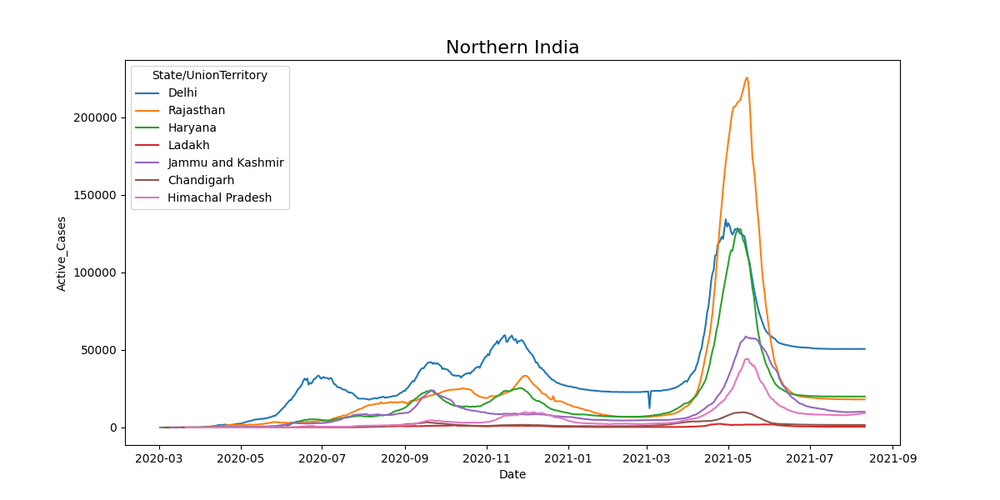

# Covid Data Analysis using Python

## Introduction

This project is aimed at performing data analysis on Covid-19 cases in India using Python. The project utilizes data collected from Kaggle in the form of csv files and provides meaningful insights into the Covid-19 situation in India. The project is built using a number of libraries including PyQt, Numpy, Pandas, Seaborn, etc.

## Technical Stack

The following technologies are used in this project:

- PyQt
- Numpy
- Pandas
- Seaborn

## Data Collection

The data for this project is collected from Kaggle in the form of csv files. The following data is used in the project:

- Covid-19 cases in India
- Age group details of Covid-19 cases in India
- Hospital bed availability in India

## Data Analysis

The data is analyzed to draw insights into the Covid-19 situation in India. The analysis includes the following aspects:

- Age group distribution of Covid-19 cases
- Hospital bed availability and its correlation with Covid-19 cases
- Trend analysis of Covid-19 cases in India

## Requirements

The following software and libraries are required to run this project:

- Python 3.x
- PyQt
- Numpy
- Pandas
- Seaborn

## Getting Started

- Clone the repository to your local machine
- Install the required libraries using `pip install -r requirements.txt`
- Run the main python file using `python GUI.py`

## Conclusion

The project provides meaningful insights into the Covid-19 situation in India and helps in understanding the impact of the pandemic on different age groups and hospital bed availability. The project is a good example of data analysis using Python and can be used as a reference for other similar projects.

## Screenshots
<!-- include Figure_1.png from ScreenShots directory present in root directory -->

# Covid Data Analysis using Python

## Introduction

This project is aimed at performing data analysis on Covid-19 cases in India using Python. The project utilizes data collected from Kaggle in the form of csv files and provides meaningful insights into the Covid-19 situation in India. The project is built using a number of libraries including PyQt, Numpy, Pandas, Seaborn, etc.

## Technical Stack

The following technologies are used in this project:

- PyQt
- Numpy
- Pandas
- Seaborn

## Data Collection

The data for this project is collected from Kaggle in the form of csv files. The following data is used in the project:

- Covid-19 cases in India
- Age group details of Covid-19 cases in India
- Hospital bed availability in India

## Data Analysis

The data is analyzed to draw insights into the Covid-19 situation in India. The analysis includes the following aspects:

- Age group distribution of Covid-19 cases
- Hospital bed availability and its correlation with Covid-19 cases
- Trend analysis of Covid-19 cases in India

## Requirements

The following software and libraries are required to run this project:

- Python 3.x
- PyQt
- Numpy
- Pandas
- Seaborn

## Getting Started

- Clone the repository to your local machine
- Install the required libraries using `pip install -r requirements.txt`
- Run the main python file using `python GUI.py`

## Conclusion

The project provides meaningful insights into the Covid-19 situation in India and helps in understanding the impact of the pandemic on different age groups and hospital bed availability. The project is a good example of data analysis using Python and can be used as a reference for other similar projects.

## Screenshots

<!-- <h3 align="center">Main UI</h3> -->

  
   
  <strong>Main UI</strong>

  
   
  <strong>India Zones</strong>

  
   
  <strong>Northern India</strong>

  
   
  <strong>Eastern India</strong>

  
   
  <strong>Central India</strong>

  
   
  <strong>North Eastern India</strong>

  
   
  <strong>Southern India</strong>

  
   
  <strong>Western India</strong>

  
   
  <strong>Compare States</strong>

  
   
  <strong>Compare States OP</strong>

  
   
  <strong>Statewise Stats</strong>

  
   
  <strong>Most Vaccinated States</strong>

  
   
  <strong>Least Vaccinated States</strong>

  
   
  <strong>Comparing Countries</strong>

  
   
  <strong>Comparing Countries OP</strong>

  
   
  <strong>India VS Other Countries</strong>

  
   
  <strong>Age Wise</strong>

  
   
  <strong>Age PIE Chart</strong>

  
   
  <strong>Gender Wise</strong>

  
   
  <strong>Gender Missing Values Excluded</strong>

  
   
  <strong>Gender Missing Values Included</strong>

